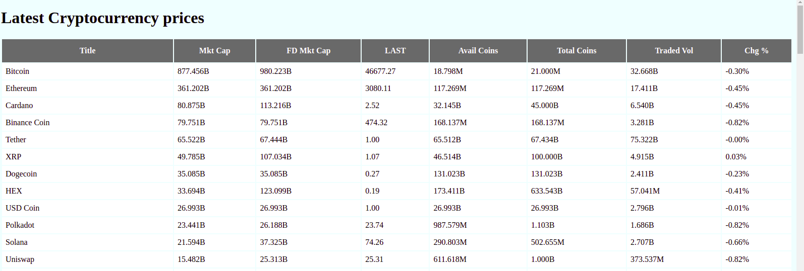

# **Scarp Tradingview website and express latest cryptocurrency information using websocket**

In this project we are going to practice Asynchronous Programming and Websocket

## **Requirements:**
1. pip install fatsapi
2. pip install uvicorn[standard]
3. pip install Scrapy

## **Usage:**
- In terminal change directory to application
- Run application: $ uvicorn fastapi:app --reload
- In the web browser goto http://localhost:8000

